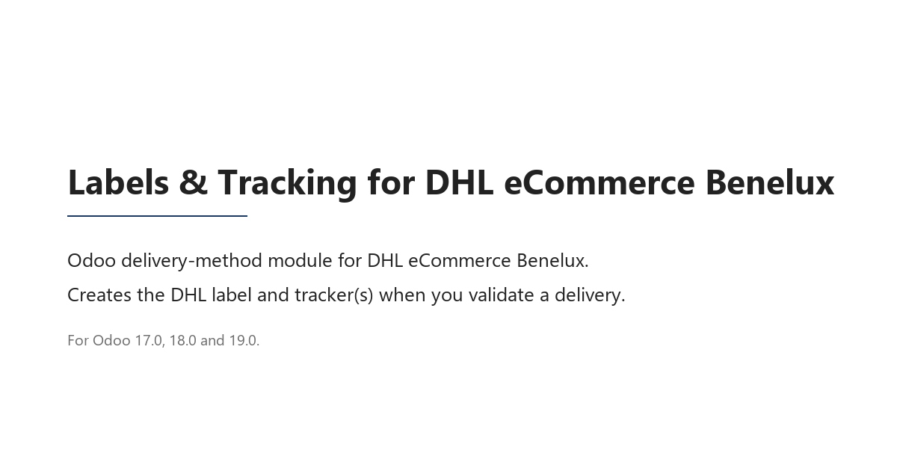

# ParcelBridge for DHL eCommerce Benelux

Native Odoo delivery-method plugin for **DHL eCommerce Benelux**.
Real shipments through the DHL Parcel API, labels + trackers on
delivery validation, contract verification per destination.

> **This branch is for Odoo 18.0.** Other branches:
> [17.0](https://github.com/bartvenken/odoo-dhl-parcelbridge/tree/17.0) ·
> [18.0](https://github.com/bartvenken/odoo-dhl-parcelbridge/tree/18.0) ·
> [19.0](https://github.com/bartvenken/odoo-dhl-parcelbridge/tree/19.0)

## Install

Available on the Odoo Apps Store: **https://apps.odoo.com/apps/modules/18.0/parcelbridge_dhl_benelux**

- Price: €149 · License: OPL-1 (source-readable, redistribution not allowed)
- Supports: Odoo 17.0, 18.0 and 19.0 (community and enterprise)
- Ships from BE / NL / LU to 31 European destinations

## Documentation

Full documentation lives on the module homepage:

- [User guide (English)](https://www.bartvenken.be/odoo-dhl-parcelbridge/guide.html) · [PDF](https://www.bartvenken.be/odoo-dhl-parcelbridge/guide.pdf)
- [Handleiding (Nederlands)](https://www.bartvenken.be/odoo-dhl-parcelbridge/handleiding.html) · [PDF](https://www.bartvenken.be/odoo-dhl-parcelbridge/handleiding.pdf)
- [Configuration & FAQ (English)](https://www.bartvenken.be/odoo-dhl-parcelbridge/faq.html)
- [Configuratie & FAQ (Nederlands)](https://www.bartvenken.be/odoo-dhl-parcelbridge/faq-nl.html)

## What it does

- Native `delivery.carrier` provider — works with sale orders, Add Shipping wizard, checkout, backorders.
- All DHL parcel types: Envelope, Mailbox parcel, Parcel up to 10 / 20 / 31 kg, Pallet up to 1000 kg.
- International destinations resolved automatically (Parcel Connect, Europlus International, Parcel Connect 2C, Europlus Pallet).
- Customs declaration auto-added for non-EU shipments (UK, Switzerland, Norway).
- Multicollo: via *Number of parcels* field or native Put-in-Pack.
- Recipient-aware filtering: consumer-only vs business-only carriers auto-hidden.
- **Verify Contract** button: probes DHL's `/products` endpoint per destination and flags missing contract products before they cause failed shipments.
- **Test Connection** button with persistent result on the carrier.
- Debug bundle export: one-click JSON export of the full delivery context with credentials redacted.
- Four languages: English, Dutch, French, German.

## Requirements

- Odoo 17.0, 18.0 or 19.0 (community or enterprise) with `stock_delivery` and `sale`.
- An **active DHL eCommerce Benelux account** with API access activated on the contract. API access is not enabled by default and has to be requested from your DHL contact.
- Shipping origin in Belgium, the Netherlands or Luxembourg.

## Support

Email: [dhlparcel.odoo@gmail.com](mailto:dhlparcel.odoo@gmail.com) · include the debug bundle from the affected delivery and we can usually diagnose in one round-trip.
